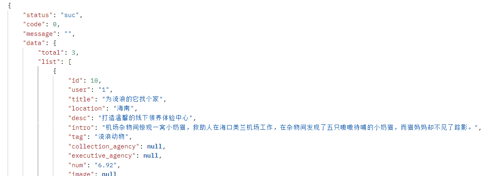

1	宠物相关
1.1	添加宠物
请求地址：get /pet/addPet
请求参数
字段	说明	类型	备注	是否必填
id
	宠物主键	String		否
name
	姓名	String		否
desc
	描述	String		否
gender
	性别	String		否
age
	年龄	String		否
weight
	体重	String		否
birth_day
	生日	String		否
create_time
	进入平台时间	String		否
health_info
	健康信息	String		否
type
	类别	String		否
Image
	图像	String		否

1.2	根据类型和性别获取所有宠物
请求地址：get      /pet/getPetListByTypeAndGender
请求参数
字段	说明	类型	备注	是否必填
type
	宠物类型	String		是
gender
	性别	String		是
返回参数
 
data：
字段	说明	类型	备注	是否必填
List
	Pet list	List		是
List：
字段	说明	类型	备注	是否必填

	Pet list	List		是
字段	说明	类型	备注	是否必填
id
	宠物主键	String		否
name
	姓名	String		否
desc
	描述	String		否
gender
	性别	String		否
age
	年龄	String		否
weight
	体重	String		否
birth_day
	生日	String		否
create_time
	进入平台时间	String		否
health_info
	健康信息	String		否
type
	类别	String		否
Image
	图像	String		否
1.3	获取所有宠物
请求地址：get      /pet/ /pet/getList
请求参数：无
返回参数
 
data：
字段	说明	类型	备注	是否必填
List
	Pet list	List		是
List：
字段	说明	类型	备注	是否必填

	Pet list	List		是
字段	说明	类型	备注	是否必填
id
	宠物主键	String		否
name
	姓名	String		否
desc
	描述	String		否
gender
	性别	String		否
age
	年龄	String		否
weight
	体重	String		否
birth_day
	生日	String		否
create_time
	进入平台时间	String		否
health_info
	健康信息	String		否
type
	类别	String		否
Image
	图像	String		否
1.1	领养宠物
请求地址：get      /pet/ /pet/ updatePetByIs_adopt
请求参数：id，宠物逐渐
返回参数：无

### 2	用户相关
### 2.1	添加用户
 **请求地址：** get   /clientUser/insertClientUser
 **请求参数** 
字段	说明	类型	备注	是否必填
id
	宠物主键	String		否
name
	姓名	String		否
phone
	电话	String		否
address
	地址	String		否
pet
	宠物id	String		否

 **二、金融服务-保险服务** 

 **接口功能：** 查询保险

 **URL：** http://172.26.160.2:9876/insurance/getInsuranceList

 **支持格式：** 

 **HTTP请求方式：** GET

 **请求参数    ** 

| 参数 | 必选 | 类型 | 说明 |
|----|----|----|----|
 **返回字段** 
| 返回字段    | 字段类型   | 说明     |
|---------|--------|--------|
| name    | String | 保险名称   |
| desc    | String | 保险描述   |
| price   | String | 保险价格   |
| feature | String | 保险特征   |
| image   | String | 保险图片   |
| tag     | String | 保险标签   |
| info    |  String| 保险详细信息 |
| type    | String | 保险类型，0-推荐，1-宠物，2-成人，3-少儿 |
返回结果

 **三、萌宠社区**

 **接口功能：** 查询社区

 **URL：** http://172.26.160.2:9876/petCommunity/getPetCommunityList

 **支持格式：** 

 **HTTP请求方式：** GET

 **请求参数    ** 

返回结果
萌宠社区返回结果

**四、公益项目**

4.1、 **接口功能：** 查询项目

 **URL：** http://172.26.160.2:9876/project/selectAllProject

 **支持格式：** 

 **HTTP请求方式：** GET/POST

 **请求参数    ** 无

返回结果

4.2、 **接口功能：** 增加项目

 **URL：** http://172.26.160.2:9876/project/insertProject

 **支持格式：** 

 **HTTP请求方式：** GET/POST

 **请求参数    ** 
| 字段                 | 是否必填  | 类型   | 备注 |
|--------------------- |------    |--------|----|
| id                   | 否       | int    |    |
| user                 | 否       | String |    |
| title                | 否       | String |    |
| location             | 否       | String |    |
| desc                 |  否      | String |    |
| intro                | 否       | String |    |
| tag                  | 否       | String |    |
| collection_agency    | 否       | String |    |
| executive_agency     | 否       | String |    |
| num                  | 否       | String |    |
| image                | 否       | String |    |

返回结果

4.3、 **接口功能：** 删除项目

 **URL：** http://172.26.160.2:9876/project/deleteProjectById

 **支持格式：** 

 **HTTP请求方式：** GET/POST

 **请求参数    ** 无
| 字段                 | 是否必填  | 类型   | 备注 |
|--------------------- |------    |--------|----|
| id                   | 否       | int    |    |

返回结果

4.4、 **接口功能：** 修改项目

 **URL：** http://172.26.160.2:9876/project/updateProject

 **支持格式：** 

 **HTTP请求方式：** GET/POST

 **请求参数    ** 
| 字段                 | 是否必填  | 类型   | 备注 |
|--------------------- |------    |--------|----|
| id                   | 否       | int    |    |
| name                 | 否       | String |    |

返回结果

